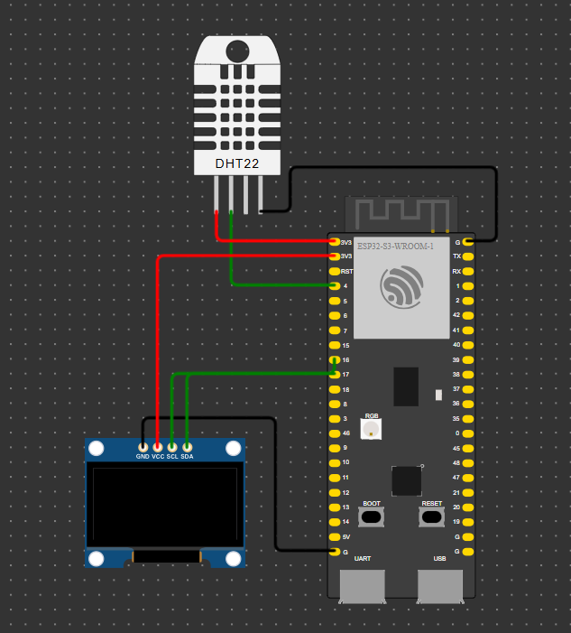

# IoT Temperature and Humidity Monitor 🌡️💧


---

## 📜 Introduction

This project is a simple yet powerful **IoT Temperature and Humidity Monitor** designed using:

  
  


It captures the ambient temperature and humidity, displays them on an OLED screen, and sends the data to a remote server over WiFi. This project is perfect for:
- 🌟 **Beginners** exploring IoT.
- 🚀 **Intermediate developers** building embedded systems.

---

## 📸 Schematic Diagram



---

## ⚙️ Features

- 🌐 **WiFi-enabled**: Send temperature and humidity data to a remote server.
- 📟 **Real-time Display**: View readings instantly on an OLED screen.
- 🔧 **Customizable**: Easily adjust sensor pins, server URL, and WiFi credentials.
- 🔋 **Low Power**: Optimized for IoT deployments.

  


---

## 🛠️ Components

| **Component**         | **Description**               | **Quantity** | **Badge**                                |
|-----------------------|------------------------------|--------------|------------------------------------------|
| ESP32                 | WiFi-enabled microcontroller | 1            |  |
| DHT22                 | Temperature & Humidity Sensor| 1            |  |
| OLED Display (I2C)    | 128x64 Pixels                 | 1            |  |
| Jumper Wires          | Male-to-Male/Female-to-Male   | As needed    |  |
| Breadboard            | For prototyping              | 1            |  |

---

## 🔌 Pin Connections

| **Component** | **Pin** | **ESP32 Pin** |
|---------------|---------|---------------|
| **DHT22**     | VCC     | 3.3V          |
|               | GND     | GND           |
|               | DATA    | GPIO4         |
| **OLED**      | VCC     | 3.3V          |
|               | GND     | GND           |
|               | SDA     | GPIO17        |
|               | SCL     | GPIO18        |

---

## 🚀 Getting Started

Follow these steps to set up the project:

### **1. Clone the Repository**

```bash
git clone https://github.com/mehrdadmb2/ESP32_DHT22_OLED_Project.git
cd ESP32_DHT22_OLED_Project
```

### **2. Install Required Libraries**
- Open Arduino IDE.  
- Install the following libraries via **Library Manager** (`Sketch > Include Library > Manage Libraries`):  
  - **Adafruit GFX**  
  - **Adafruit SSD1306**  
  - **DHT sensor library**  
  - **Adafruit Unified Sensor**  

### **3. Open the Code**
- Open the file `iot_temperature_humidity.ino` in Arduino IDE.

### **4. Update WiFi and Server Details**
Replace the placeholders in the code with your WiFi credentials and server URL:
```cpp
const char* ssid = "Your_SSID";         // Replace with your WiFi name
const char* password = "Your_Password"; // Replace with your WiFi password
const char* serverURL = "http://your-server.com/api"; // Replace with your server URL
```

### **5. Upload Code**

- Select the correct **Board** and **Port** (`Tools > Board`).
- Click the **Upload** button.

---

## 📈 How It Works

1. **Initialization**:
   - The ESP32 connects to the WiFi network.
   - The OLED display initializes and shows connection status.

2. **Data Capture**:
   - The DHT22 sensor measures temperature and humidity.

3. **Data Display**:
   - The OLED displays temperature and humidity in real-time.

4. **Data Transmission**:
   - The data is sent to the specified server as an HTTP POST request.

---

## 🖥️ Example Output

### **OLED Display**

```
Temp: 25.3 C
Humidity: 60.5 %
```

### **Serial Monitor**

```
WiFi connected!
Temp: 25.3 C
Humidity: 60.5 %
Data sent successfully!
```

---

## 💡 Troubleshooting

- **Problem**: OLED is not displaying data.  
  **Solution**: Verify SDA and SCL connections and ensure the I2C address matches your OLED.

- **Problem**: Failed to connect to WiFi.  
  **Solution**: Check WiFi credentials and ensure the network is in range.

- **Problem**: DHT sensor reads `nan`.  
  **Solution**: Verify the sensor connections and type (`DHT22`).

---

## 📜 License

This project is licensed under the MIT License - see the [LICENSE](LICENSE) file for details.

---

## 🤝 Contributing

  
Contributions are welcome! Feel free to submit issues, fork the repository, or open a pull request.

---

## 🌟 Acknowledgements

Special thanks to:
- [Adafruit](https://www.adafruit.com/) for their amazing libraries.
- The open-source community for making IoT projects accessible to everyone.

---

## 📊 Badges


<!--
```

این نسخه بهبود یافته شامل بدج‌های جذاب‌تر و ساختاری مرتب‌تر است. اگر نیاز به تغییر بیشتری دارید، اطلاع دهید! 😊
-->
